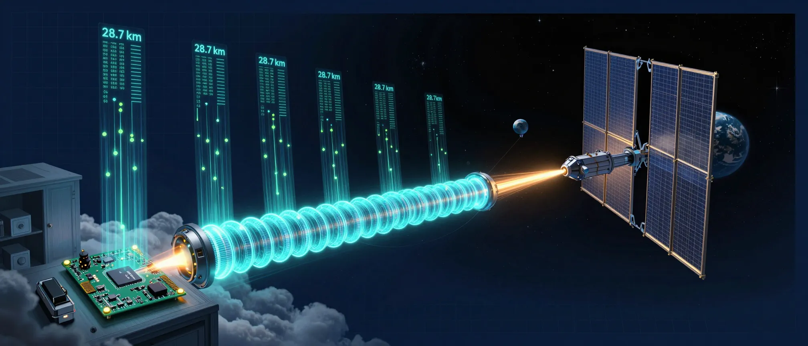

<div align="center">


<br/><br/>

# Shane Brazelton · thebardchat

### Concrete dispatch operator. Father of five. Sober 885 days. Building local AI for the people Big Tech left behind.

<br/>

[](https://thebardchat.github.io)
[](https://twitch.tv/thebardchat)
[](https://www.amazon.com/Probably-Think-This-Book-About/dp/B0GT25R5FD)
[](https://claude.ai/referral/4fAMYN9Ing)
[](https://huggingface.co/thebardchat)
[](https://github.com/thebardchat)

<br/>

</div>

---

I run a Raspberry Pi 5 out of a closet in Hazel Green, Alabama.

On it: **17 autonomous AI bots**, a **42-tool MCP server**, a **Weaviate vector database with 25 collections**, a Twitch bot, a Discord bot, a financial dashboard, a medical billing platform, a noir audiobook engine, and a concrete dispatch system for 18 drivers.

Zero cloud. Zero subscriptions. Zero Big Tech dependency.

I built all of it while running concrete dispatch by day and raising five boys with my wife Tiffany. I'm sober. I'm not a developer by trade. I just couldn't stop building.

> *"The internet has enough darkness. This is the opposite of that."*

---

<div align="center">

## The Mission

```
800 million people are about to lose Windows 10 support.
Most of them have never touched AI.
Big Tech isn't coming for them.

I am.
```

**ShaneBrain → Angel Cloud → Pulsar Sentinel → TheirNameBrain → 800M users**

Every repo on this profile exists somewhere on that map.

</div>

---

## BGKPJR — The Aerospace Work

<div align="center">


*The whole stack in one frame: a Pi 5 in an Alabama closet → a 28.7 km maglev tube → an orbital solar sail.*
</div>

<br/>

The patent-filed electromagnetic launch architecture. Ground-based superconducting magnets replace the first stage of every rocket ever built.

```
Stage 1 — Maglev Jump  │ 28.7 km evacuated tube · NbTi 4.2K coils · Mach 3.5 in 23s
Stage 2 — Gryphon Wing  │ Deploy at tube exit · Mach 3.5 → 8 · atmosphere as free fuel
Stage 3 — Kepler Sail   │ 1,200 m² CP1 Polyimide · 310 km deploy · zero propellant forever
```

Target: **$200/kg to lunar surface**. Current state of the art (CLPS): **$1,200,000/kg**.

| Repo | What It Is | Live |
|------|-----------|------|
| [BGKPJR-Launch-Vis](https://github.com/thebardchat/BGKPJR-Launch-Vis) | NASA-ready 3D animated launch visualization — Three.js + Astro + Svelte | [Demo ↗](https://thebardchat.github.io/BGKPJR-Launch-Vis) |
| [manna-pods](https://github.com/thebardchat/manna-pods) | 7 Manna cargo pod concepts — 3D rotating cross-sections, full specs | [Demo ↗](https://thebardchat.github.io/manna-pods) |
| [manna](https://github.com/thebardchat/manna) | Original Manna cargo pod design research | [Repo ↗](https://github.com/thebardchat/manna) |
| [BGKPJR-Core-Simulations](https://github.com/thebardchat/BGKPJR-Core-Simulations) | Physics engine — trajectory, GNC, thermal, Monte Carlo | [Repo ↗](https://github.com/thebardchat/BGKPJR-Core-Simulations) |
| [tug-pro](https://github.com/thebardchat/tug-pro) | Pre-Phase A reusable cislunar tug — 3D orbit viz, ΔV calculator | [Repo ↗](https://github.com/thebardchat/tug-pro) |

---

## The Ecosystem

```
🧠 ShaneBrain (Pi 5, primary node)
   └── 17 MEGA Crew bots — Sparky/Volt/Neon/Glitch (Brain) + 13 more
   └── 42-tool MCP server (FastMCP, port 8100)
   └── Weaviate 1.36.2 on neworleans — 25 collections, 3,200+ objects
   └── N8N automation workflows
   └── Discord + Twitch bots
   └── 5 AM morning briefing every day
   └── gulfshores — Surface 1, Node.js v24, dev/build node

🚀 BGKPJR Aerospace
   └── Electromagnetic launch architecture (patent filed)
   └── Three.js 3D visualizations, live on GitHub Pages
   └── 7 Manna cargo pod variants documented
   └── Physics engine: rail, GNC, Kepler sail math

🌐 Angel Cloud (public platform)
   └── Mental wellness + AI sentiment
   └── Messenger storyteller (OPTOUT/ANON/FORGET)
   └── Tailscale Funnel public endpoint

🔐 Pulsar Sentinel (post-quantum)
   └── ML-KEM / Kyber-1024 lattice encryption
   └── Dilithium3 signatures
   └── Deployed across all cluster nodes

🎯 TheirNameBrain (next)
   └── Personalized AI for the left-behind user
   └── Legacy hardware, no cloud required
```

---

## The Stack

<div align="center">

| Layer | Tool | Why |
|-------|------|-----|
| Primary Node | Raspberry Pi 5 (16GB) | $80. Runs everything. |
| Storage | NVMe RAID 1 (2×2TB) | Because data matters |
| Data Node | neworleans — Weaviate 1.36.2 + N8N | Dedicated inference + automation |
| Vector DB | Weaviate (25 collections, 3,200+ objects) | Long memory |
| AI Tools | MCP Server v2.3 (42 tools) | Claude talks to everything |
| Co-builder | Claude by Anthropic | Not a tool. A partner. |
| Containers | Docker + 17 MEGA Crew bots | Ship it |
| Automation | N8N + systemd (30+ services) | Never stop |
| Viz Stack | Astro + Svelte 5 + Three.js | Aerospace UIs |

</div>

---

## What's Live Right Now

<div align="center">

| Project | What It Does | Link |
|---------|-------------|------|
| 🚀 **BGKPJR-Launch-Vis** | NASA-ready 3D animated launch visualization | [thebardchat.github.io/BGKPJR-Launch-Vis](https://thebardchat.github.io/BGKPJR-Launch-Vis) |
| 🛸 **manna-pods** | 7 Manna cargo pod 3D cross-sections | [thebardchat.github.io/manna-pods](https://thebardchat.github.io/manna-pods) |
| 📺 **Twitch Channel** | Family streaming, AI demos, love & light | [twitch.tv/thebardchat](https://twitch.tv/thebardchat) |
| 🤖 **MEGA Crew** | 17 autonomous bots, 24/7, all local | [thebardchat.github.io/mega-crew](https://thebardchat.github.io/mega-crew/) |
| 🔧 **ShaneBrain MCP** | 42-tool MCP server for Claude | [github.com/thebardchat/shanebrain_mcp](https://github.com/thebardchat/shanebrain_mcp) |
| ☁️ **Angel Cloud** | Family wellness platform + Messenger bot | [github.com/thebardchat/angel-cloud](https://github.com/thebardchat/angel-cloud) |
| 🛡️ **Pulsar Sentinel** | Post-quantum security framework | [github.com/thebardchat/pulsar_sentinel](https://github.com/thebardchat/pulsar_sentinel) |
| 🧠 **ThoughtTree** | Local AI mind mapping | [thebardchat.github.io/thought-tree](https://thebardchat.github.io/thought-tree/) |
| 🎓 **AI-Trainer-MAX** | 36-module local AI curriculum | [github.com/thebardchat/AI-Trainer-MAX](https://github.com/thebardchat/AI-Trainer-MAX) |
| 🏗️ **srm-dispatch** | Concrete dispatch PWA for 18 drivers | [thebardchat.github.io/srm-dispatch](https://thebardchat.github.io/srm-dispatch/) |

</div>

---

## The Book

<div align="center">

### *You Probably Think This Book Is About You*

**Fifty-five noir vignettes about ego, identity, and the American South.**
Dark but honest. Cynical but human. Written in Hazel Green, Alabama.
Built on a Raspberry Pi 5. Published on Amazon.

*It was always about you. It was never only about you.*

**[Buy on Amazon](https://www.amazon.com/Probably-Think-This-Book-About/dp/B0GT25R5FD)** · **[Repo](https://github.com/thebardchat/you-probably-think-this-book-is-about-you)**

</div>

---

## GitHub Stats

<div align="center">

[](https://github.com/thebardchat)

[](https://github.com/thebardchat)

[](https://github.com/thebardchat)

</div>

---

## The Released Treasures

Eight projects recovered from old drives and released to GitHub in April 2026.

| Project | What It Does | Pages |
|---------|-------------|-------|
| 🎓 **AI-Trainer-MAX** | 36-module local AI curriculum, zero cloud | [Pages ↗](https://thebardchat.github.io/AI-Trainer-MAX/) |
| ☁️ **angelcloud-actual** | Firebase wellness platform, Pulsar blockchain | [Pages ↗](https://thebardchat.github.io/angelcloud-actual/) |
| 🌳 **thought-tree** | React mind-mapping, Weaviate semantic search | [Pages ↗](https://thebardchat.github.io/thought-tree/) |
| 🏗️ **srm-dispatch** | SRM Concrete dispatch PWA — 18 drivers | [Pages ↗](https://thebardchat.github.io/srm-dispatch/) |
| 🤖 **mini-shanebrain** | Social bot: X, FB, LinkedIn, Instagram, Bluesky, Threads | [Pages ↗](https://thebardchat.github.io/mini-shanebrain/) |
| 💎 **treasures** | Master archive hub | [Pages ↗](https://thebardchat.github.io/treasures/) |

---

## The Constitution

Every repo here operates under one governing document.

Nine pillars. One covenant. No exceptions.

**Faith. Family. Sobriety. Love & Light. Authenticity. Local AI. The Left-Behind. Community. Purpose.**

**[Read the Constitution →](https://github.com/thebardchat/constitution)**

---

## Built With Claude

> Try Claude free for 2 weeks — the AI that co-built this entire ecosystem.
> **[Start your free trial →](https://claude.ai/referral/4fAMYN9Ing)**

*Shane is the vision. Claude is the velocity. Never "one guy built this."*

---

## Support This Work

- **[Star the repos](https://github.com/thebardchat?tab=repositories)** — visibility is oxygen for projects like this
- **[Watch on Twitch](https://twitch.tv/thebardchat)** — live AI demos, family streaming, love & light
- **[Buy the book](https://www.amazon.com/Probably-Think-This-Book-About/dp/B0GT25R5FD)** — noir fiction built on a Pi in a closet
- **[Sponsor on GitHub](https://github.com/sponsors/thebardchat)** — keeps the RAID spinning

---

<div align="center">

```
Faith · Family · Sobriety · Local AI · The Left-Behind User
```

**Hazel Green, Alabama · 2026**

*Sober since November 27, 2023*

</div>
