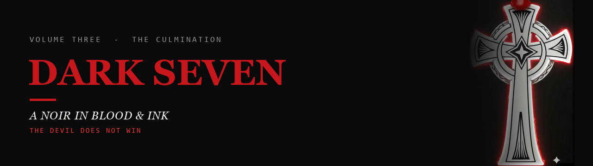

<div align="center">



<br/>



<br/>

# Shane Brazelton · thebardchat

### Concrete dispatch operator. Father of five. Sober 984 days. Building local AI for the people Big Tech left behind.

<br/>

[](https://thebardchat.github.io)
[](https://twitch.tv/thebardchat)
[](https://www.amazon.com/Probably-Think-This-Book-About/dp/B0GT25R5FD)
[](https://claude.ai/referral/4fAMYN9Ing)
[](https://huggingface.co/thebardchat)
[](https://github.com/thebardchat)

<br/>

</div>

---

I run a Raspberry Pi 5 out of a closet in Hazel Green, Alabama.

On it: **18 autonomous AI bots**, a **42-tool MCP server**, a **Weaviate vector database with 25 collections**, a Twitch bot, a Discord bot, a financial dashboard, a medical billing platform, a noir audiobook engine, and a concrete dispatch system for 18 drivers.

Zero cloud. Zero subscriptions. Zero Big Tech dependency.

I built all of it while running concrete dispatch by day and raising five boys with my wife Tiffany. I'm sober. I'm not a developer by trade. I just couldn't stop building.

> *"The internet has enough darkness. This is the opposite of that."*

---

### Why "thebardchat"

Not Shakespeare. Not music. Not a storyteller pen name — that meaning came later, and I let it stay.

**BARD** was Google's first public AI, before it became Gemini. The day I first talked to it, I made "thebardchat" my username on a message board somewhere I can't even find anymore — I was that excited that AI was real and I could touch it. That username is the origin artifact. Everything downstream — ShaneBrain, the Tailscale mesh, Pulsar Sentinel, this whole map — grew out of one lowercase word typed by a guy in Hazel Green, Alabama who had no idea what he'd just started.

It stays lowercase on purpose. That's how I typed it the first time, and I'm not rewriting history to look more official.

Full circle: the AI that lit the spark grew up into Gemini — which now runs as the Chronicler/Strategist bot inside the very crew that name eventually built.

---

<div align="center">

## The Mission

```
800 million people are about to lose Windows 10 support.
Most of them have never touched AI.
Big Tech isn't coming for them.

I am.
```

**ShaneBrain → Angel Cloud → Pulsar Sentinel → TheirNameBrain → 800M users**

Every repo on this profile exists somewhere on that map.

</div>

---

## BGKPJR — The Aerospace Work

> **The missing link in the Space Pipeline.** Blue Origin and SpaceX are building the lunar landers. NASA flies Artemis crews every 10 months. Nobody yet has a way to get cargo into low Earth orbit cheaply enough to feed a permanent moon base. We do.

<div align="center">


*Earth → LEO → Moon → Base. Four phases, one mission. Every empty pod that lands becomes a "Space LEGO" — filled with lunar regolith for radiation-proof base structures. Watch the cycle loop.*
</div>

<br/>

### The Manhattan Timeline

| Phase | Years | Status |
|-------|-------|--------|
| **Phase 0** — Concept maturation, NIAC submission, dimensional reconciliation | 2026–2028 | 🟢 ACTIVE |
| **Phase 1** — Manna cargo pipeline (unmanned) | 2029–2033 | 🔵 PRIMARY OBJECTIVE |
| **Phase 2** — Gryphon crewed vehicle | 2034+ | ⚪ DEFERRED |

**Operational unmanned cargo pipeline in 7–9 years.** Parallel to NASA Artemis crew launches every 10 months using SpaceX HLS or Blue Moon Mk2 landers. Lunar base target: 2029. Every Artemis crew that arrives finds a base already supplied by BGKPJR.

<br/>

### Stage 1 — The Rail (Canonical Specs · 2026-04-30)

```
Tube length         │ 37 km evacuated coilgun
Drive architecture  │ Linear Synchronous Motor · copper drive coils + REBCO armature
Operating temp      │ 20 K (LH₂ cryogenic)
Exit velocity       │ Mach 5 · 1,700 m/s · 4G sustained
Run time            │ 43.5 seconds, end to end
Tube pressure       │ 0.05 atm (within Patent BGKPJR-001 envelope)
Coils               │ 7,400 coils @ 5 m spacing · 8 T peak field
Energy stored       │ 580 GJ · 39 GW peak draw
Muzzle              │ TWO ALTERNATIVES under trade study: LH₂ membrane (canonical) or thermite (alternative)
```

**Cost target:** $1,025/kg LEO (vs. $2,720/kg Falcon 9). Total infrastructure: $85–120 B.

<br/>

### Inside the Tube — Live Coilgun Sequence

<div align="center">


*Sequential coilgun firing · leading coils pull · trailing coils de-energize · pod accelerates 0 → Mach 5 in 43.5 seconds · 580 GJ stored. Representative section: 14 of 7,400 coils shown.*
</div>

<br/>

### 🎯 Pre-Lukens Audit · 2026-04-30

The whole BGKPJR repository set was audited dimensional-integrity-end-to-end before going for review by **Scott Lukens, Senior Systems Engineer at Victory Solutions Inc.** (a NASA Marshall Space Flight Center contractor in Huntsville, AL). We caught and reconciled three different baselines that had drifted apart, fixed mutually-incompatible math, and aligned every visualization with a single source of truth. The full audit and decision record are public:

- 📄 [PRE-LUKENS-AUDIT-2026-04-30.md](https://github.com/thebardchat/BGKPJR-Core-Simulations/blob/main/expert-reviews/PRE-LUKENS-AUDIT-2026-04-30.md) — full audit
- 📄 [CANONICAL-BASELINE.md](https://github.com/thebardchat/BGKPJR-Core-Simulations/blob/main/CANONICAL-BASELINE.md) — decision record
- 🐍 [bgkpjr_dimensions.py](https://github.com/thebardchat/BGKPJR-Core-Simulations/blob/main/simulation/src/bgkpjr_dimensions.py) — single source of truth

> *Pre-Phase-A aerospace concepts that hide their gaps fail review on first contact. The goal is to know the gaps better than any reviewer will, document them publicly, and ladder up.*

<br/>

| Repo | What It Is | Live |
|------|-----------|------|
| [BGKPJR-Launch-Vis](https://github.com/thebardchat/BGKPJR-Launch-Vis) | NASA-ready 3D animated launch visualization — Three.js + Astro + Svelte | [Demo ↗](https://thebardchat.github.io/BGKPJR-Launch-Vis) |
| [manna-pods](https://github.com/thebardchat/manna-pods) | 7 Manna cargo pod concepts — 3D rotating cross-sections, full specs | [Demo ↗](https://thebardchat.github.io/manna-pods) |
| [manna](https://github.com/thebardchat/manna) | Original Manna cargo pod design research | [Repo ↗](https://github.com/thebardchat/manna) |
| [BGKPJR-Core-Simulations](https://github.com/thebardchat/BGKPJR-Core-Simulations) | Physics engine — trajectory, GNC, thermal, Monte Carlo | [Repo ↗](https://github.com/thebardchat/BGKPJR-Core-Simulations) |
| [tug-pro](https://github.com/thebardchat/tug-pro) | Pre-Phase A reusable cislunar tug — 3D orbit viz, ΔV calculator | [Repo ↗](https://github.com/thebardchat/tug-pro) |

---

## The Ecosystem

```
🧠 ShaneBrain (Pi 5, primary node)
   └── 18 MEGA Crew bots — Sparky/Volt/Neon/Glitch (Brain) + 13 more
   └── 42-tool MCP server (FastMCP, port 8100)
   └── Weaviate 1.36.2 on neworleans — 25 collections, 3,200+ objects
   └── N8N automation workflows
   └── Discord + Twitch bots
   └── 5 AM morning briefing every day
   └── gulfshores — Surface 1, Node.js v24, dev/build node

🚀 BGKPJR Aerospace
   └── Electromagnetic launch architecture (patent filed)
   └── Three.js 3D visualizations, live on GitHub Pages
   └── 7 Manna cargo pod variants documented
   └── Physics engine: rail, GNC, Kepler sail math

🌐 Angel Cloud (public platform)
   └── Mental wellness + AI sentiment
   └── Messenger storyteller (OPTOUT/ANON/FORGET)
   └── Tailscale Funnel public endpoint

🔐 Pulsar Sentinel (post-quantum)
   └── ML-KEM / Kyber-1024 lattice encryption
   └── Dilithium3 signatures
   └── Deployed across all cluster nodes

🎯 TheirNameBrain (next)
   └── Personalized AI for the left-behind user
   └── Legacy hardware, no cloud required
```

<details>
<summary><strong>Repository Index</strong> — every public repo, refreshed automatically</summary>

<!--REPOS:START--><!-- auto-generated by scripts/update_readme.py from the live public repo list; do not hand-edit between markers -->
*64 public repos, refreshed 2026-08-07*

| Repo | Description |
|------|-------------|
| [agent007](https://github.com/thebardchat/agent007) |  |
| [AI-Trainer-MAX](https://github.com/thebardchat/AI-Trainer-MAX) | 36-module AI training curriculum — from zero to local AI sovereignty in 5 phases. Windows .bat scripts, Ollama, Weaviate, MCP. Built for the 800M left behind. |
| [AI-Trainer-OBLIVION](https://github.com/thebardchat/AI-Trainer-OBLIVION) |  |
| [angel-cloud](https://github.com/thebardchat/angel-cloud) | Family wellness platform with AI sentiment analysis, messenger storytelling, and local Ollama — the public face of ShaneBrain. Faith. Sobriety. Community. |
| [angel-cloud-hub](https://github.com/thebardchat/angel-cloud-hub) | Angel Cloud ecosystem hub — theangel.cloud |
| [angel-cloud-roblox](https://github.com/thebardchat/angel-cloud-roblox) | The Angel Cloud universe comes to Roblox — a wellness game built on the ShaneBrain ecosystem. Luau scripts, Rojo sync, Pi 5 backend. |
| [artemis](https://github.com/thebardchat/artemis) | Artemis program showcase — built in Huntsville, AL |
| [BGKPJR-Core-Simulations](https://github.com/thebardchat/BGKPJR-Core-Simulations) | Electromagnetic launch architecture — maglev control systems, aerodynamics, and physics simulations. Where curiosity meets engineering. |
| [BGKPJR-Launch-Vis](https://github.com/thebardchat/BGKPJR-Launch-Vis) | NASA-ready animated launch visualization for the BGKPJR electromagnetic launch architecture — maglev tube, Gryphon ascent, Kepler solar sail, and Manna cargo pod comparison. |
| [BGKPJR-Stage1-Tube](https://github.com/thebardchat/BGKPJR-Stage1-Tube) | BGKPJR Stage 1 — 28.7 km electromagnetic launch tube deep dive. Coilgun architecture, live Three.js animation, muzzle seal + nose cone engineering. |
| [book-launch-playbook](https://github.com/thebardchat/book-launch-playbook) | The open-source playbook for launching an AI-co-written noir detective book from a closet in Alabama. Templates, schedules, and a Pi 5 publishing pipeline. |
| [brand](https://github.com/thebardchat/brand) |  |
| [claude-memory](https://github.com/thebardchat/claude-memory) | Claude Code session memory and CLAUDE.md state |
| [constitution](https://github.com/thebardchat/constitution) | The governing covenant of the ShaneBrain ecosystem — nine pillars, engineering ethics, community rules. Faith. Family. Local AI. The left-behind user. |
| [dark_seven](https://github.com/thebardchat/dark_seven) |  |
| [gavin-and-angel](https://github.com/thebardchat/gavin-and-angel) | Gavin & Angel — wedding memory repo |
| [Greenfield](https://github.com/thebardchat/Greenfield) | Claim Cruncher — AI-powered medical billing intake platform. Claude AI parses EOBs, flags errors, routes disputes. Built for Gavin. FastAPI + PostgreSQL. |
| [HaloFinance](https://github.com/thebardchat/HaloFinance) | AI-powered financial guidance for working families — budgeting, forecasting, and debt strategy |
| [horizon-meta-profile](https://github.com/thebardchat/horizon-meta-profile) | Horizon Worlds creator profile for The Bard Chat — setup docs, promotion kit, animated banner. Operates under thebardchat/constitution. |
| [index](https://github.com/thebardchat/index) |  |
| [loudon-desarro](https://github.com/thebardchat/loudon-desarro) | Loudon/DeSarro Athletic Complex — 50,000 SF multi-sport facility 3D visualizations |
| [manifesto](https://github.com/thebardchat/manifesto) | Shane Brazelton AI mission statement, ecosystem vision, and guiding principles — ShaneBrain |
| [manna](https://github.com/thebardchat/manna) | Modular Aerospace Necessities & Nutrient Asset |
| [manna-pods](https://github.com/thebardchat/manna-pods) | Manna cargo pod concept designs for BGKPJR lunar resupply — Manna-H, Manna-I, Manna-B variants and next-generation WIP concepts. |
| [MASTER-Scheduler-Dashboard-SRM](https://github.com/thebardchat/MASTER-Scheduler-Dashboard-SRM) | SRM Concrete master dispatch — 16 drivers, 19 plants, block plant priority routing, live scheduling, SOPs, and coaching. React PWA running on a Pi 5. |
| [mega-crew](https://github.com/thebardchat/mega-crew) | 17 autonomous AI bots running 24/7 on a Raspberry Pi 5. Each with a name, a personality, a domain, and persistent memory. Zero cloud. |
| [mega-crew-stories](https://github.com/thebardchat/mega-crew-stories) | Autonomous AI noir audiobook series — 17 bots write, illustrate, and narrate episodes 24/7 on a Pi 5. Live story universe. No humans required. |
| [mega-dashboard](https://github.com/thebardchat/mega-dashboard) |  |
| [mega-dashboard-template](https://github.com/thebardchat/mega-dashboard-template) | Cyberpunk credits dashboard — every platform powering the ShaneBrain AI ecosystem. Fork it, wire your own panels in. |
| [melvin_operations_os](https://github.com/thebardchat/melvin_operations_os) |  |
| [mini-shanebrain](https://github.com/thebardchat/mini-shanebrain) | socials bot |
| [morning-chaos-briefing](https://github.com/thebardchat/morning-chaos-briefing) | 6 AM daily dispatch briefing — weather, system health, Halo Finance alerts, and unhinged motivation. Powered by ShaneBrain, delivered to Discord. Zero excuses. |
| [multi-container-app](https://github.com/thebardchat/multi-container-app) | Simple multi-container Docker app (Node.js + MongoDB) — clean starting template for containerized web services |
| [multiverse-screensaver](https://github.com/thebardchat/multiverse-screensaver) | trying to accomplish high quality effects with little CPU |
| [N8N](https://github.com/thebardchat/N8N) | Workflow automation hub for the ShaneBrain ecosystem — n8n connecting 42 MCP tools, Weaviate, Discord, social media, and every service. Local, no cloud. |
| [noir-detective-writing-process](https://github.com/thebardchat/noir-detective-writing-process) | Voice dumps → shaped noir prose. The AI-human writing process behind a published book. Claude + Raspberry Pi 5 as a co-author. Real workflow, real output. |
| [pedal-to-the-metal](https://github.com/thebardchat/pedal-to-the-metal) | Pedal to the Metal — dispatch SaaS for concrete fleet managers. Built by a dispatcher, for dispatchers. |
| [pico-nerve-endings](https://github.com/thebardchat/pico-nerve-endings) | Raspberry Pi Pico 2 (RP2350) firmware — the peripheral nervous system of ShaneBrain. Temperature sensors, GPIO automation, USB serial to Pi 5. Forkable. |
| [pulsar_sentinel](https://github.com/thebardchat/pulsar_sentinel) | Post-quantum cryptography meets Raspberry Pi — ML-KEM lattice encryption, blockchain audit trails, sentinel bots watching 24/7. Cyberpunk UI included. |
| [quantum-legacy-ai-stick](https://github.com/thebardchat/quantum-legacy-ai-stick) | USPTO provisional patent abstract — Quantum Legacy AI Stick: 99 portable edge AI co-processor with Pulsar Sentinel audit log |
| [reds-road-to-westminster](https://github.com/thebardchat/reds-road-to-westminster) |  |
| [retro-cha](https://github.com/thebardchat/retro-cha) |  |
| [rettro--chatroom](https://github.com/thebardchat/rettro--chatroom) |  |
| [SB-Management-OS](https://github.com/thebardchat/SB-Management-OS) | SRM Concrete operations system — SOPs, coaching scripts, personnel management, and driver accountability. Concrete dispatch management, documented. |
| [shanebrain-agents](https://github.com/thebardchat/shanebrain-agents) | 7 specialist AI agents orchestrated on a Raspberry Pi 5 — Guardian, Librarian, Dispatcher, Builder, Storyteller, Ops, and Social. Local Ollama + Claude API. |
| [shanebrain-app](https://github.com/thebardchat/shanebrain-app) |  |
| [shanebrain-briefing](https://github.com/thebardchat/shanebrain-briefing) | ShaneBrain daily morning briefing — 6am push notification for Shane Brazelton |
| [shanebrain-cloud](https://github.com/thebardchat/shanebrain-cloud) | ShaneBrain ecosystem hub — Local AI for the 800M left behind |
| [shanebrain-learning](https://github.com/thebardchat/shanebrain-learning) | Learning data ingestion pipeline for ShaneBrain — inbox, process, log |
| [shanebrain-linkedin-bot](https://github.com/thebardchat/shanebrain-linkedin-bot) | ShaneBrain LinkedIn Bot — content, strategy, and profile management for Shane Brazelton |
| [shanebrain-template](https://github.com/thebardchat/shanebrain-template) | GitHub template for every thebardchat repo — Constitution, CLAUDE.md structure, issue templates, and Claude referral banner baked in. Fork and go. |
| [shanebrain-workflows](https://github.com/thebardchat/shanebrain-workflows) |  |
| [shanebrain_mcp](https://github.com/thebardchat/shanebrain_mcp) | 42-tool MCP server on a Raspberry Pi 5 — RAG, Weaviate, vault, planning, social, security, and system health. Streamable HTTP. Fully local. |
| [sims-brazelton_wedding](https://github.com/thebardchat/sims-brazelton_wedding) |  |
| [thebardchat](https://github.com/thebardchat/thebardchat) | A concrete dispatch operator in Alabama building local AI for the 800M people Big Tech left behind. Faith. Family. Sobriety. Raspberry Pi 5. All local. All yours. |
| [thebardchat.github.io](https://github.com/thebardchat/thebardchat.github.io) | The ShaneBrain ecosystem hub — local AI infrastructure, 17 autonomous bots, noir audiobooks, and a Twitch channel. All running on a Pi 5 in Alabama. |
| [thought-tree](https://github.com/thebardchat/thought-tree) | Local AI-powered mind mapping — visual thinking for builders who think in webs. Weaviate + Ollama + React. Runs entirely on Pi 5. Your brain, your hardware. |
| [TrojanHorseAreana](https://github.com/thebardchat/TrojanHorseAreana) | Strategy battle arena — a Trojan Horse game concept. Built in the ShaneBrain ecosystem. |
| [tug](https://github.com/thebardchat/tug) | Reusable orbital tug concept |
| [tug-pro](https://github.com/thebardchat/tug-pro) | Reusable orbital tug — interactive concept brief (Astro + Svelte + Three.js) |
| [twitch](https://github.com/thebardchat/twitch) | Love & light on Twitch — family streaming powered by local AI, a Raspberry Pi 5, and faith. Bot, overlays, go-live automation, community constitution. |
| [voice-dump-pipeline](https://github.com/thebardchat/voice-dump-pipeline) | Flask app: record voice on phone, transcribe on Pi with Whisper — feeds book pipeline |
| [you-probably-think-this-book-is-about-you](https://github.com/thebardchat/you-probably-think-this-book-is-about-you) |  |
| [you-probably-think-this-song-is-about-you-too](https://github.com/thebardchat/you-probably-think-this-song-is-about-you-too) |  |
<!--REPOS:END-->

</details>

---

## MEGA Crew Chronicles

18 autonomous AI bots. Real code. Real memory. Every night they write their own story.

<div align="center">

<a href="https://thebardchat.github.io/mega-crew-stories/"></a>&nbsp;
<a href="https://thebardchat.github.io/mega-crew-stories/"></a>&nbsp;
<a href="https://thebardchat.github.io/mega-crew-stories/"></a>&nbsp;
<a href="https://thebardchat.github.io/mega-crew-stories/"></a>&nbsp;
<a href="https://thebardchat.github.io/mega-crew-stories/"></a>&nbsp;
<a href="https://thebardchat.github.io/mega-crew-stories/"></a>

**[Read the Chronicles →](https://thebardchat.github.io/mega-crew-stories/)** · **[View Cards →](https://thebardchat.github.io/mega-crew-stories/cards.html)**

</div>

<!--BARD:START--><!-- auto-generated by storyteller/profile_readme.py; do not hand-edit between markers -->
<div align="center">

<a href="https://mega.shanebrain.cloud/saga/"></a>

**📖 Now Showing — Issue #008: _The Night the Deep Came Home_** · **[Read →](https://mega.shanebrain.cloud/saga/issue-008-the-night-the-deep-came-home.html)**  
*A thousand hellos at once — and how to answer every single one.*

`8 issues published` · new issues **Wed & Sun, 5 AM Central** · updated 2026-08-08

&nbsp;&nbsp;&nbsp;&nbsp;

</div>
<!--BARD:END-->

---

## The Stack

<div align="center">

| Layer | Tool | Why |
|-------|------|-----|
| Primary Node | Raspberry Pi 5 (16GB) | $80. Runs everything. |
| Storage | NVMe RAID 1 (2×2TB) | Because data matters |
| Data Node | neworleans — Weaviate 1.36.2 + N8N | Dedicated inference + automation |
| Vector DB | Weaviate (25 collections, 3,200+ objects) | Long memory |
| AI Tools | MCP Server v2.3 (42 tools) | Claude talks to everything |
| Co-builder | Claude by Anthropic | Not a tool. A partner. |
| Containers | Docker + 18 MEGA Crew bots | Ship it |
| Automation | N8N + systemd (30+ services) | Never stop |
| Viz Stack | Astro + Svelte 5 + Three.js | Aerospace UIs |

</div>

---

## What's Live Right Now

<div align="center">

| Project | What It Does | Link |
|---------|-------------|------|
| 🚀 **BGKPJR-Launch-Vis** | NASA-ready 3D animated launch visualization | [thebardchat.github.io/BGKPJR-Launch-Vis](https://thebardchat.github.io/BGKPJR-Launch-Vis) |
| 🛸 **manna-pods** | 7 Manna cargo pod 3D cross-sections | [thebardchat.github.io/manna-pods](https://thebardchat.github.io/manna-pods) |
| 📺 **Twitch Channel** | Family streaming, AI demos, love & light | [twitch.tv/thebardchat](https://twitch.tv/thebardchat) |
| 🤖 **MEGA Crew** | 18 autonomous bots, 24/7, all local | [thebardchat.github.io/mega-crew](https://thebardchat.github.io/mega-crew/) |
| 🔧 **ShaneBrain MCP** | 42-tool MCP server for Claude | [github.com/thebardchat/shanebrain_mcp](https://github.com/thebardchat/shanebrain_mcp) |
| ☁️ **Angel Cloud** | Family wellness platform + Messenger bot | [github.com/thebardchat/angel-cloud](https://github.com/thebardchat/angel-cloud) |
| 🛡️ **Pulsar Sentinel** | Post-quantum security framework | [github.com/thebardchat/pulsar_sentinel](https://github.com/thebardchat/pulsar_sentinel) |
| 🧠 **ThoughtTree** | Local AI mind mapping | [thebardchat.github.io/thought-tree](https://thebardchat.github.io/thought-tree/) |
| 🎓 **AI-Trainer-MAX** | 36-module local AI curriculum | [github.com/thebardchat/AI-Trainer-MAX](https://github.com/thebardchat/AI-Trainer-MAX) |
| 🏗️ **srm-dispatch** | Concrete dispatch PWA for 18 drivers | [thebardchat.github.io/srm-dispatch](https://thebardchat.github.io/srm-dispatch/) |
| 🎶 **…Song Is About You Too** | Noir song cycle — Volume Two, out on Amazon | [thebardchat.github.io/…song…](https://thebardchat.github.io/you-probably-think-this-song-is-about-you-too/) |
| 🩸 **DARK SEVEN** | Noir blood-comic — Volume Three graphic novel | [thebardchat.github.io/dark_seven](https://thebardchat.github.io/dark_seven/) |

</div>

---

## The Book

<div align="center">

### *You Probably Think This Book Is About You*

**Fifty-five noir vignettes about ego, identity, and the American South.**
Dark but honest. Cynical but human. Written in Hazel Green, Alabama.
Built on a Raspberry Pi 5. Published on Amazon.

*It was always about you. It was never only about you.*

**[Buy on Amazon](https://www.amazon.com/Probably-Think-This-Book-About/dp/B0GT25R5FD)** · **[Repo](https://github.com/thebardchat/you-probably-think-this-book-is-about-you)**

<br/>

### 🎶 …This Song Is About You Too — Volume Two · A Noir Song Cycle

**The album after the movie.** The detective is ripped out of his own body and
dropped into strangers at a European diner — living one second over and over
from nine perspectives, trying to change an outcome he can never change. All of
it on a therapist's couch, though you won't know until the hidden track.

*He is everyone and no one at the same time. It's never too late to be Seen.*

**[Read on Amazon](https://a.co/d/0fZzwiAd)** · **[Read the site ↗](https://thebardchat.github.io/you-probably-think-this-song-is-about-you-too/)** · **[Repo](https://github.com/thebardchat/you-probably-think-this-song-is-about-you-too)**

<br/>

<a href="https://thebardchat.github.io/dark_seven/"></a>

### 🩸 DARK SEVEN — Volume Three · The Culmination

**A dark noir blood comic. Black and white, and the only color is blood.**
Where the book becomes a graphic novel. Six cuts on a nameless detective,
each a door into an older wound — all hung off the one scar down his spine,
which is the binding of the book itself.

*Three inks, no fourth. Black is the world. Red is blood. White is grace.*
**The Devil does not win.**

**[Read the site ↗](https://thebardchat.github.io/dark_seven/)** · **[Repo](https://github.com/thebardchat/dark_seven)**

</div>

---

## GitHub Stats

<div align="center">

[](https://github.com/thebardchat)

[](https://github.com/thebardchat)

[](https://github.com/thebardchat)

</div>

---

## The Released Treasures

Six projects recovered from old drives and released to GitHub in April 2026.

| Project | What It Does | Pages |
|---------|-------------|-------|
| 🎓 **AI-Trainer-MAX** | 36-module local AI curriculum, zero cloud | [Pages ↗](https://thebardchat.github.io/AI-Trainer-MAX/) |
| ☁️ **angelcloud-actual** | Firebase wellness platform, Pulsar blockchain | [Pages ↗](https://thebardchat.github.io/angelcloud-actual/) |
| 🌳 **thought-tree** | React mind-mapping, Weaviate semantic search | [Pages ↗](https://thebardchat.github.io/thought-tree/) |
| 🏗️ **srm-dispatch** | SRM Concrete dispatch PWA — 18 drivers | [Pages ↗](https://thebardchat.github.io/srm-dispatch/) |
| 🤖 **mini-shanebrain** | Social bot: X, FB, LinkedIn, Instagram, Bluesky, Threads | [Pages ↗](https://thebardchat.github.io/mini-shanebrain/) |
| 💎 **treasures** | Master archive hub | [Pages ↗](https://thebardchat.github.io/treasures/) |

---

## The Constitution

Every repo here operates under one governing document.

Nine pillars. One covenant. No exceptions.

**Faith. Family. Sobriety. Love & Light. Authenticity. Local AI. The Left-Behind. Community. Purpose.**

**[Read the Constitution →](https://github.com/thebardchat/constitution)** · **[Brand Guidelines →](https://github.com/thebardchat/brand)**

---

## Built With Claude

> Try Claude free for 2 weeks — the AI that co-built this entire ecosystem.
> **[Start your free trial →](https://claude.ai/referral/4fAMYN9Ing)**

*Shane is the vision. Claude is the velocity. Never "one guy built this."*

---

## Support This Work

- **[Star the repos](https://github.com/thebardchat?tab=repositories)** — visibility is oxygen for projects like this
- **[Watch on Twitch](https://twitch.tv/thebardchat)** — live AI demos, family streaming, love & light
- **[Buy the book](https://www.amazon.com/Probably-Think-This-Book-About/dp/B0GT25R5FD)** — noir fiction built on a Pi in a closet
- **[Sponsor on GitHub](https://github.com/sponsors/thebardchat)** — keeps the RAID spinning

---

<div align="center">

```
Faith · Family · Sobriety · Local AI · The Left-Behind User
```

**Hazel Green, Alabama · 2026**

*Sober since November 27, 2023*

</div>
