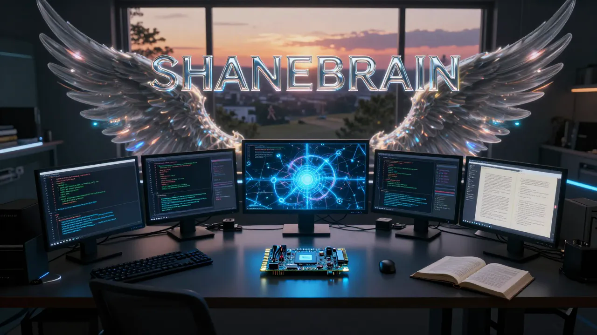
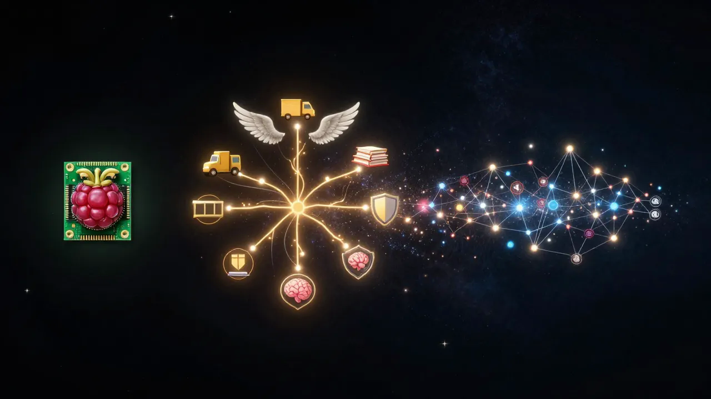

<!-- thebardchat/thebardchat — GitHub Profile README -->

<div align="center">



<br/>

# Shane Brazelton

**Dispatcher. Father. Coach. Builder. Author.**

[](https://github.com/sponsors/thebardchat)
[](https://github.com/thebardchat/constitution)
[](https://www.amazon.com/Probably-Think-This-Book-About/dp/B0GT25R5FD)
[](https://huggingface.co/thebardchat)

*Sober since November 27, 2023*

</div>

---

I dispatch dump trucks by day and build local AI infrastructure by night — running a full AI stack on a Raspberry Pi 5 in a closet in Hazel Green, Alabama. Five sons. A wife who holds it all together. A faith that won't quit.

Everything I build serves one mission: **putting real AI tools in the hands of the ~800 million people Big Tech is about to leave behind.**

I build because I have to. And because I couldn't stop if I tried.

---

## The Book

<div align="center">

### *You Probably Think This Book Is About You*

**A collection of noir vignettes about ego, identity, and the universal human condition.**

Written in third person. Dark but light. Cynical but comical.

*It was always about you. It was never only about you.*

**[Buy on Amazon](https://www.amazon.com/Probably-Think-This-Book-About/dp/B0GT25R5FD)** · **[The writing process](https://github.com/thebardchat/noir-detective-writing-process)** · **[Launch playbook](https://github.com/thebardchat/book-launch-playbook)**

</div>

---

## The Ecosystem

<div align="center">

</div>

<br/>

```
ShaneBrain          →  Local AI on Pi 5. Private. Yours.
  └── Angel Cloud   →  Public platform. Families. Mental wellness.
        └── Pulsar Sentinel   →  Enterprise. Post-quantum crypto.
              └── TheirNameBrain   →  Legacy AI. Personalized. Generational.
                    └── ~800M users losing Windows 10 support in 2025
```

Every repo I build exists somewhere on this map.

---

## The Stack

<table>
  <tr>
    <td align="center" width="150">
      <b>Raspberry Pi 5</b><br/>
      <sub>16GB RAM</sub>
    </td>
    <td align="center" width="150">
      <b>Pironman 5-MAX</b><br/>
      <sub>NVMe RAID 1</sub>
    </td>
    <td align="center" width="150">
      <b>Ollama</b><br/>
      <sub>Local LLM inference</sub>
    </td>
    <td align="center" width="150">
      <b>Weaviate</b><br/>
      <sub>Vector database</sub>
    </td>
    <td align="center" width="150">
      <b>FastMCP</b><br/>
      <sub>42 AI tools</sub>
    </td>
    <td align="center" width="150">
      <b>Docker</b><br/>
      <sub>Container orchestration</sub>
    </td>
  </tr>
</table>

---

## Active Repositories

### Core Infrastructure

| Repo | What It Is |
|------|-----------|
| [shanebrain-core](https://github.com/thebardchat/shanebrain-core) | The brain — Discord bot, RAG, Weaviate, social automation, cloud backup |
| [shanebrain_mcp](https://github.com/thebardchat/shanebrain_mcp) | 42-tool MCP server — knowledge, chat, vault, planning, security |
| [constitution](https://github.com/thebardchat/constitution) | The governing covenant for this entire ecosystem |
| [angel-cloud](https://github.com/thebardchat/angel-cloud) | Mental wellness platform with auth bridge and AI sentiment |
| [pulsar_sentinel](https://github.com/thebardchat/pulsar_sentinel) | Post-quantum cryptography security framework |

### Work & Operations

| Repo | What It Is |
|------|-----------|
| [MASTER-Scheduler-Dashboard-SRM](https://github.com/thebardchat/MASTER-Scheduler-Dashboard-SRM) | SRM Concrete master dispatch — 16 drivers, 19 plants, block plant priority routing |
| [SB-Management-OS](https://github.com/thebardchat/SB-Management-OS) | Business operations hub — SOPs, coaching scripts, personnel management |

### Creative & Education

| Repo | What It Is |
|------|-----------|
| [noir-detective-writing-process](https://github.com/thebardchat/noir-detective-writing-process) | The AI-human writing pipeline behind the book |
| [book-launch-playbook](https://github.com/thebardchat/book-launch-playbook) | Zero-budget book launch framework for indie authors |
| [AI-Trainer-MAX](https://github.com/thebardchat/AI-Trainer-MAX) | 36-module AI training curriculum — zero to local AI sovereignty |

### Tools & Platforms

| Repo | What It Is |
|------|-----------|
| [HaloFinance](https://github.com/thebardchat/HaloFinance) | AI-powered financial guidance for working families |
| [BGKPJR-Core-Simulations](https://github.com/thebardchat/BGKPJR-Core-Simulations) | Electromagnetic launch architecture simulations |
| [loudon-desarro](https://github.com/thebardchat/loudon-desarro) | 50,000 SF athletic complex 3D visualizations |
| [thought-tree](https://github.com/thebardchat/thought-tree) | React mind-mapping and brain-dump app |
| [morning-chaos-briefing](https://github.com/thebardchat/morning-chaos-briefing) | Daily 6 AM dispatch briefing — weather, Pi status, finance alerts, Chaos Score, delivered to Discord |
| [N8N](https://github.com/thebardchat/N8N) | Workflow automation hub — n8n on pulsar00100 connecting the cluster |
| [thebardchat.github.io](https://github.com/thebardchat/thebardchat.github.io) | Ecosystem hub page |

---

## The Constitution

> Every repo in this organization operates under one governing document.

**[Read the ShaneTheBrain Constitution](https://github.com/thebardchat/constitution/blob/main/CONSTITUTION.md)**

Nine pillars. One covenant. No exceptions.

---

## Support This Work

If what I'm building matters to you — local AI for real people, books written on a Pi in a closet, tools for the left-behind — there are ways to help:

- **[Sponsor me on GitHub](https://github.com/sponsors/thebardchat)** — even $1/month keeps the RAID spinning
- **[Buy the book](https://www.amazon.com/Probably-Think-This-Book-About/dp/B0GT25R5FD)** — a noir detective story built on a Raspberry Pi
- **Star the repos** — visibility matters for projects like this
- **Share the constitution** — the mission is bigger than the code

---

## Built With — The Partners That Made This Real

<table>
  <tr>
    <td align="center" width="160">
      <b>Claude by Anthropic</b><br/>
      <sub>Co-builder of this entire ecosystem.<br/>Not a tool. A partner.</sub><br/><br/>
      <a href="https://claude.ai"><code>claude.ai</code></a>
    </td>
    <td align="center" width="160">
      <b>Raspberry Pi 5</b><br/>
      <sub>The compute that made<br/>local AI real and affordable.</sub><br/><br/>
      <a href="https://www.raspberrypi.com"><code>raspberrypi.com</code></a>
    </td>
    <td align="center" width="160">
      <b>Pironman 5-MAX</b><br/>
      <sub>NVMe RAID 1 chassis<br/>by Sunfounder.</sub><br/><br/>
      <a href="https://www.sunfounder.com"><code>sunfounder.com</code></a>
    </td>
    <td align="center" width="160">
      <b>Hugging Face</b><br/>
      <sub>AI models, image generation,<br/>and open-source community.</sub><br/><br/>
      <a href="https://huggingface.co"><code>huggingface.co</code></a>
    </td>
  </tr>
</table>

> *"I could not have done any of this without them."*

---

<div align="center">

```
Faith · Family · Sobriety · Local AI · The Left-Behind User
```

*Hazel Green, Alabama · 2026*

</div>
